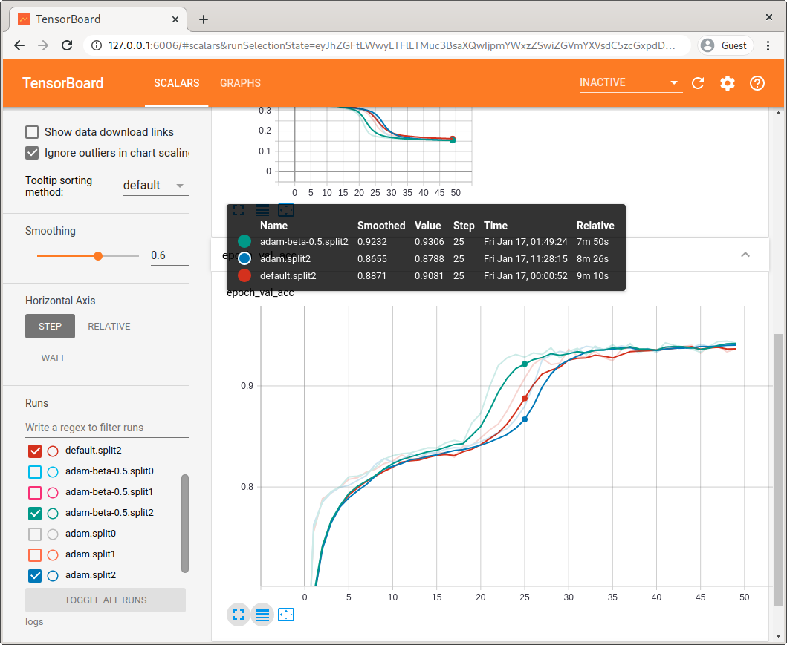

# Zalando Classification Task

## Problem Description

We’re given a dataset with the following properties:

* **Size:** 1,000,000 (1 million) datapoints
* **Dimensionality:** 100
* **Classes:** 2 (binary classification)
* **Balance:** Perfectly balanced (50% positive, 50% negative)

### Hints

1. We’re told that the optimal classifier is around 90% accurate. This is 
   possible to know if one has access to the underlying data generating process 
   and can compute the densities `P(x | y=1)` and `P(x | y=0)`. 
   The Bayes optimal classifier is then given by `P(y=1|x) = P(x | y=1) / [P(x | y=1) + P(x | y=0)]` 
   (see https://tiao.io/post/density-ratio-estimation-for-kl-divergence-minimization-between-implicit-distributions/ 
   for an example derivation).
2. We’re also told that the features are highly-dependent.

## Approach

Before diving into any sophisticated techniques, it’s always a good idea to try
out some naive methods to use as a baseline, like **Naive Bayes (NB)** or 
**k-Nearest Neighbors (k-NN)**. 
Thereafter, it’s reasonable to attack the problem with popular methods that 
have consistently dominated in data science competitions like Kaggle. Some of 
these include ensemble methods like **Random Forests** and **Gradient Boosting (XGBoost)**. 
Some other promising approaches include **Multi-layer Perceptrons (MLPs)**, 
**Support Vector Classification (SVC)** and **Gaussian Process Classification (GPC)**. 

### Preliminary results

For model evaluation, we first created a hold-out test set  consisting of 20% 
of the datapoints we were given. With the naive baselines (**NB, k-NN**), we 
hovered around 50% test accuracy.

In preliminary analysis (without making significant effort to tune the model 
hyperparameters), we consistently obtained at best around 55% test accuracy 
with **Random Forests**, **Gradient Boosting** and **SVC**.

In the last model (**GPC**), exact posterior inference is not tractable, 
especially given with size of the dataset. While approximate methods are 
available, it is left outside the scope of this solution set. I felt it 
deserved a special mention nonetheless since it particularly suitable for this 
problem — it is capable of capturing complex dependencies between features
(which is important according to Hint 2), and comes with a principled approach
feature selection when Automatic Relevance Determination (ARD) kernels are used.

### **Multi-layer Perceptron**

We obtained decent results with Multi-layer Perceptions (MLPs). In particular, 
we considered a simple family of MLPs with "rectangular-shapes" (number 
of hidden units are constant across all hidden layers). We primarily 
experimented with 2 hidden layers each with 64 hidden units, and ReLU 
activations.

We assessed our model with *k*-fold cross-validation. Since each model takes 
approximately 20 mins to train for 50 epochs, and we need to train a separate 
model for each fold, we limit *k* to a modest value of *k=3*.

Across cross-validation folds, with slight variations on hyperparameters such
as optimizer parameters, **we were able to consistently achieve a validation accuracy of around 94%** as shown in the learning curve plots below. 
The *hue* represents different optimizers/parameters; the top row shows the 
train accuracy over epochs while the bottom row shows the validation accuracy;
the *solid lines* denotes the mean accuracy across folds while the *shaded 
error bands* denotes the standard deviation.


While varying the optimizers and their parameters didn't have a significant 
impact on final performance (all eventually converge to around 94%), some 
settings resulting in faster convergence than others. In particular, one can
observe that Adam with *beta1=0.5* converges faster than RMSProp, which in turn
converges faster than Adam with *beta1=0.9* (the default in practically all 
deep learning libraries).

We also experimented with different data pre-processing methods such as 
normalization and whitening (standardization), but these mostly had deleterious 
effects on performance. The same was true for regularization methods such as 
weight decay and Dropout, and also for layer normalization techniques such as 
Batch normalization, which worsened performance by as much as 10%.

## Usage

Clone this repository:

```
$ git clone https://github.com/ltiao/zalando-classification.git
```

The datasets are tracked using text pointers with [Git Large File Storage (LFS)](https://git-lfs.github.com/).
It is recommended that this be installed prior to cloning.

### Getting started

The quickest way to get started is by running the Docker container from the 
root of the repo.

```console
$ docker run -it --rm tiao/zalando-classification --help
Usage: zalando_classification [OPTIONS] NAME

Options:
  --optimizer TEXT
  -e, --epochs INTEGER            Number of epochs.
  -b, --batch-size INTEGER        Batch size.
  --evaluate-only                 Skip model fitting. Only evaluate model.
  --resume-from-epoch INTEGER     Epoch at which to resume a previous training
                                  run
  --l1-factor FLOAT               L1 regularization factor.
  --l2-factor FLOAT               L2 regularization factor.
  --batch-norm / --no-batch-norm  Use Batch Normalization (after activation).
  --standardize
  --split-method [kfold|shuffle]  Method for generating train/test dataset
                                  splits.
  --n-splits INTEGER              Number of train/test dataset splits.
  --test-size FLOAT               Test set size (for shuffle split method
                                  only).
  --checkpoint-dir DIRECTORY      Model checkpoint directory.
  --checkpoint-period INTEGER     Interval (number of epochs) between
                                  checkpoints.
  --summary-dir DIRECTORY         Summary directory.
  -s, --seed INTEGER              Random seed
  --help                          Show this message and exit.
```

### GPU Support

Use [Nvidia Container Toolkit](https://github.com/NVIDIA/nvidia-docker/blob/master/README.md#quickstart) to run with Nvidia GPU Support. Append option `--gpus all` to
the `docker run` command.

### Reproducing results from pre-trained model

To reproduce results with pre-trained model, run the following (from the 
directory containing the `datasets/` and `models/` directories):

```console
$ docker run --gpus all -it --rm -v "$PWD/datasets":/usr/src/app/datasets -v "$PWD/models":/usr/src/app/models tiao/zalando-classification --seed=8888 --split-method=kfold --n-splits=3 --evaluate-only --resume-from-epoch=50 rmsprop
333334/333334 [==============================] - 9s 26us/sample - loss: 0.1589 - acc: 0.9450
[Split 0] test accuracy: 0.945, test loss 0.159
333333/333333 [==============================] - 8s 23us/sample - loss: 0.1727 - acc: 0.9387
[Split 1] test accuracy: 0.939, test loss 0.173
333333/333333 [==============================] - 8s 24us/sample - loss: 0.1697 - acc: 0.9398
[Split 2] test accuracy: 0.940, test loss 0.170
```

### Train model from scratch

To train new models from scratch:

```console
$ docker run -it --rm --gpus all -v "$PWD/datasets":/usr/src/app/datasets -v "$PWD/models":/usr/src/app/models -v "/logs":/usr/src/app/logs tiao/zalando-classification --seed=8888 --split-method=kfold --n-splits=3 new  
```

You can find model checkpoints in `$PWD/models`, logs of losses and metrics in 
`$PWD/logs`, both in CSV format and as TensorBoard Summaries. In another 
terminal window, you can launch TensorBoard at the appropriate log directory, e.g.

```console
$ tensorboard --logdir=$PWd/logs
```

Navigate to http://127.0.0.1:6006/ in your browser to see live training 
summaries updated in real-time:



### Compile documentation

To compile documentation (which generates the learning curve plots shown above):

```console
$ docker run -it --rm -v "$PWD/docs":/usr/src/app/docs -v "$PWD/logs":/usr/src/app/logs tiao/zalando-classification make docs
```

### Docker Build

To build the image from scratch:

```console
$ make docker-build
```

## Credits

The boilerplate for this package was created with [Cookiecutter] and the 
[audreyr/cookiecutter-pypackage] project template.

[Cookiecutter]: https://github.com/audreyr/cookiecutter
[audreyr/cookiecutter-pypackage]: https://github.com/audreyr/cookiecutter-pypackage
