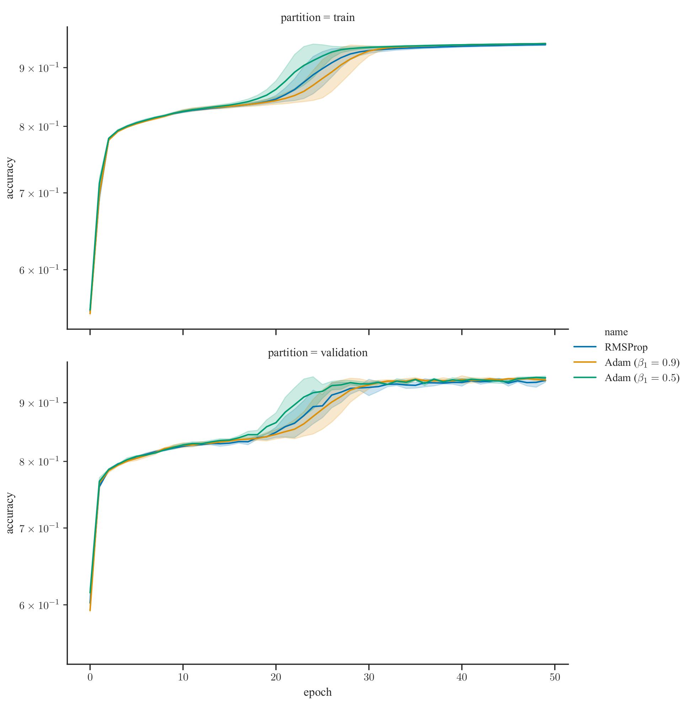

# Zalando Coding Exercise

## Problem Description

We’re given a dataset with the following properties:

* **Size:** 1,000,000 (1 million) datapoints
* **Dimensionality:** 100
* **Classes:** 2 (binary classification)
* **Balance:** Perfectly balanced (50% positive, 50% negative)

### Hints

1. We’re told that the optimal classifier is around 90% accurate. This is 
   possible to know if one has access to the underlying data generating process 
   and can compute the densities `P(x | y=1)` and `P(x | y=0)`. 
   The Bayes optimal classifier is then given by `P(y=1|x) = P(x | y=1) / [P(x | y=1) + P(x | y=0)]` 
   (see https://tiao.io/post/density-ratio-estimation-for-kl-divergence-minimization-between-implicit-distributions/ 
   for an example derivation).
2. We’re also told that the features are highly-dependent.

## Approach

Before diving into any sophisticated techniques, it’s always a good idea to try
out some naive methods to use as a baseline, like **Naive Bayes (NB)** or 
**k-Nearest Neighbors (k-NN)**. 
Thereafter, it’s reasonable to attack the problem with popular methods that 
have consistently dominated in data science competitions like Kaggle. Some of 
these include ensemble methods like **Random Forests** and **Gradient Boosting (XGBoost)**. 
Some other promising approaches include **Multi-layer Perceptrons (MLPs)**, 
**Support Vector Classification (SVC)** and **Gaussian Process Classification (GPC)**. 

### Preliminary results

For model evaluation, we first created a hold-out test set  consisting of 20% 
of the datapoints we were given. With the naive baselines (**NB, k-NN**), we 
hovered around 50% test accuracy.

In preliminary analysis (without making significant effort to tune the model 
hyperparameters), we consistently obtained at best around 55% test accuracy 
with **Random Forests**, **Gradient Boosting** and **SVC**.

In the last model (**GPC**), exact posterior inference is not tractable, 
especially given with size of the dataset. While approximate methods are 
available, it is left outside the scope of this solution set. I felt it 
deserved a special mention nonetheless since it is of particular interest for 
this problem — it is capable of capturing complex dependencies between features
(which is important according to Hint 2), and comes with a principled approach
feature selection when Automatic Relevance Determination (ARD) kernels are used.

### **Multi-layer Perceptron**

Multi-layer Perception with two hidden layers and a “rectangular-shape” (number 
of hidden units are constant across all hidden layers).

*k*-fold cross-validation with *k=3*

since each model takes approximately 20 mins to train for 50 epochs, and we 
need to train a separate model for each fold, we limit k to a modest value k=3

the *solid lines* denotes the mean accuracy across folds while the *shaded 
error bands* denotes the standard deviation.



## Usage

Clone this repository:

```
$ git clone https://github.com/ltiao/zalando-classification.git
```

The datasets are tracked using text pointers with [Git Large File Storage (LFS)](https://git-lfs.github.com/).
It is recommended that this be installed prior to cloning.

### Getting Started

The quickest way to get started is by running a Docker container from the root 
of the repo.

```console
$ docker run -it --rm tiao/zalando-classification --help
Usage: zalando_classification [OPTIONS] NAME

Options:
  --optimizer TEXT
  -e, --epochs INTEGER            Number of epochs.
  -b, --batch-size INTEGER        Batch size.
  --evaluate-only                 Skip model fitting. Only evaluate model.
  --resume-from-epoch INTEGER     Epoch at which to resume a previous training
                                  run
  --l1-factor FLOAT               L1 regularization factor.
  --l2-factor FLOAT               L2 regularization factor.
  --batch-norm / --no-batch-norm  Use Batch Normalization (after activation).
  --standardize
  --split-method [kfold|shuffle]  Method for generating train/test dataset
                                  splits.
  --n-splits INTEGER              Number of train/test dataset splits.
  --test-size FLOAT               Test set size (for shuffle split method
                                  only).
  --checkpoint-dir DIRECTORY      Model checkpoint directory.
  --checkpoint-period INTEGER     Interval (number of epochs) between
                                  checkpoints.
  --summary-dir DIRECTORY         Summary directory.
  -s, --seed INTEGER              Random seed
  --help                          Show this message and exit.
```

To reproduce results with pre-trained model, run the following (from the 
directory containing the `datasets/` and `models/` directories):

```console
$ docker run --gpus all -it --rm -v "$PWD/datasets":/usr/src/app/datasets -v "$PWD/models":/usr/src/app/models tiao/zalando-classification --seed=8888 --split-method=kfold --n-splits=3 --evaluate-only --resume-from-epoch=50 rmsprop
333334/333334 [==============================] - 9s 26us/sample - loss: 0.1589 - acc: 0.9450
[Split 0] test accuracy: 0.945, test loss 0.159
333333/333333 [==============================] - 8s 23us/sample - loss: 0.1727 - acc: 0.9387
[Split 1] test accuracy: 0.939, test loss 0.173
333333/333333 [==============================] - 8s 24us/sample - loss: 0.1697 - acc: 0.9398
[Split 2] test accuracy: 0.940, test loss 0.170
```

### Preprocessing

* Whitening

### **Feature Selection**

## Metrics

Cross-validation

* Accuracy
* ROC Curve
* Confusion matrix

## Credits

The boilerplate for this package was created with [Cookiecutter] and the 
[audreyr/cookiecutter-pypackage] project template.

[Cookiecutter]: https://github.com/audreyr/cookiecutter
[audreyr/cookiecutter-pypackage]: https://github.com/audreyr/cookiecutter-pypackage
